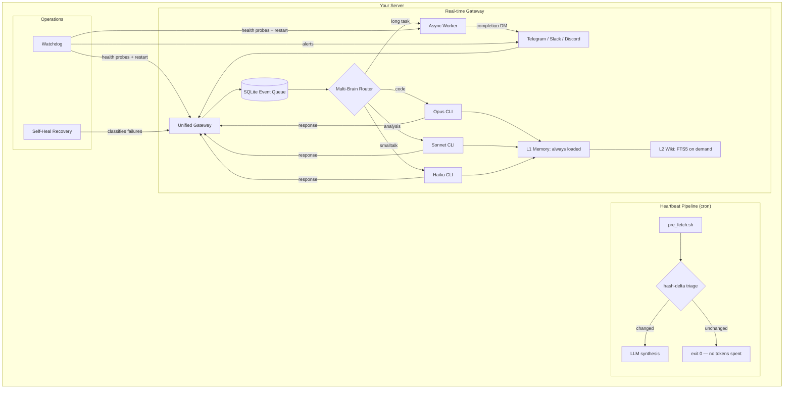

# JuliusCaesar

[](https://opensource.org/licenses/MIT)
[](https://github.com/matsei-ruka/juliuscaesar/releases/tag/v2026.05.02)
[](https://www.python.org/downloads/)
[](https://www.anthropic.com/claude-code)


**A self-hosted personal AI assistant framework built for engineers who care about production.**

JuliusCaesar invokes the **native Claude Code CLI** as a subprocess — not API simulation, not session spoofing. It's the only assistant framework that runs on your actual subscription. Pair that with a production watchdog, a token-efficient cron pipeline, and a layered memory system, and you have something that stays online and stays useful — without a monthly SaaS bill or 430,000 lines of someone else's code to debug.

---

## Why JuliusCaesar

### Subscription-native execution

Other frameworks simulate the Claude API. JC invokes `claude`, `aider`, `codex`, and `gemini` as real subprocesses — the same binaries you run from your terminal. No API key injection. No TOS gymnastics. Your subscription, your terms.

### Built for 24/7 operation

A cron-triggered watchdog with health probes, exponential backoff, and a restart budget keeps your assistant online. The heartbeat pipeline runs background synthesis tasks only when content has actually changed — zero tokens wasted.

### Ops-first memory

The L1/L2 memory split is designed the way a production engineer thinks. **L1** is always loaded: a small set of markdown files injected into every session. Your identity, your rules, your hot context — no retrieval latency, no token guessing. **L2** is a FTS5-indexed Obsidian-compatible wiki, surfaced on demand. You pay for retrieval only when you need depth.

### Readable architecture

~50 Python files with a clear structure, not a monorepo of 430,000+ lines. You can read the gateway in an afternoon. You can trace a Telegram message through the queue to the brain and back. You own the code because you can understand it.

---

## Architecture



---

## Features

| Feature | What it does |
|---|---|
| **Native CLI execution** | Invokes `claude`, `aider`, `gemini`, `codex` as subprocesses. Uses your real subscription. Policy-compliant by design. |
| **Multi-brain routing** | Per-message triage routes to the right model. Haiku for chat, Opus for code, Sonnet for analysis. |
| **L1/L2 memory** | L1: always-loaded markdown context (identity, rules, hot cache). L2: FTS5-indexed wiki surfaced on demand. Obsidian-compatible. Wikilinks graph. |
| **Deterministic heartbeat** | `cron` → `bash pre_fetch` → hash-delta check → LLM synthesis. Zero tokens if nothing changed. |
| **Production watchdog** | PID + heartbeat file + cwd health probes. Exponential backoff (5s → 300s). Restart budget. Telegram alerts on state transitions. |
| **Async workers** | Double-forked detached background agents. Deliver results via Telegram DM. SQLite state tracking. |
| **Self-heal recovery** | Classifies failures (transient, session_expired, session_missing, bad_input) and applies typed handlers. Not blind retry. |
| **Telegram group auth** | Bot added → pending → operator approves via inline keyboard. Auth status in SQLite with WAL isolation. |
| **MarkdownV2 renderer** | Two-pass escaper handles all reserved chars. Brains write plain markdown; gateway delivers bold/italic/code/links natively. Graceful fallback on parse error. |
| **Voice subsystem** | DashScope Qwen TTS/ASR + speaker enrollment. Full voice reply path in Telegram. |
| **Two-repo architecture** | Framework (this repo, open source) + instance (your private repo). Zero user data in the framework. Secrets in `<instance>/.env` mode 600. |
| **`jc` CLI** | Unified router: `jc memory`, `jc watchdog`, `jc workers`, `jc gateway`, `jc doctor --fix`, `jc update`. |

---

## Quick Start

**Prerequisites:** Python 3.11+, git, curl, screen, ffmpeg, and [Claude Code](https://www.anthropic.com/claude-code) installed + logged in.

```bash
# 1. Clone and install the framework
git clone https://github.com/matsei-ruka/juliuscaesar ~/juliuscaesar
cd ~/juliuscaesar && ./install.sh

# 2. Set up your private instance
jc setup ~/my-assistant

# 3. Run diagnostics and auto-repair
cd ~/my-assistant
jc doctor --fix

# 4. Start the gateway
jc gateway start

# 5. Install the watchdog (cron-triggered supervisor)
jc watchdog install
```

Full walkthrough: [QUICKSTART.md](./QUICKSTART.md).

---

## The `jc` CLI

```
jc memory      — knowledge base (L2 wiki + FTS5 search)
jc heartbeat   — scheduled task runner
jc voice       — TTS / ASR / speaker enrollment
jc watchdog    — process supervisor
jc workers     — on-demand background agents
jc chats       — Telegram chat directory
jc gateway     — unified event queue + brain dispatch
jc doctor      — diagnostics + auto-repair
jc update      — check and apply framework updates
jc init        — scaffold a new instance
jc setup       — guided first-run configurator
```

---

## Why Not X?

### OpenClaw

OpenClaw is the dominant framework in this space — 347k+ GitHub stars, 5,700 community skills on ClawHub, enterprise security. We built JuliusCaesar because OpenClaw simulates the Claude API rather than invoking the CLI, which creates policy friction for subscription users and couples you to their abstraction layer. OpenClaw is the right choice if you want the biggest marketplace and the smoothest onboarding. JC is the right choice if you want to run on your actual subscription and own your deployment from the OS up.

### Nanobot

Nanobot is ~4,000 lines of clean, readable Python with MCP support. It's excellent for getting something running quickly. It doesn't include a watchdog, a heartbeat pipeline, async workers, multi-brain routing, or a recovery system — the production operations layer that makes the difference between a demo and a daily driver. If your assistant needs to stay online at 3am without you touching it, you need more than Nanobot provides.

### Hermes Agent

Hermes Agent (Nous Research) is a genuinely interesting framework focused on self-improving agents that write reusable skills as they solve problems. It's growing fast. Its memory architecture is not ops-focused (no L1/L2 token budget separation), it doesn't use native CLI execution, and its production operations story is less developed. If self-improvement and skill generation are your primary interest, follow Hermes. If you want a production-hardened ops stack running on the tools you already pay for, JuliusCaesar is sharper.

---

## Who This Is For

**You'll love JuliusCaesar if:**
- You self-host and believe in owning your infrastructure
- You have a Claude (or other) subscription and want to use the actual CLI, not an API simulation
- You think in terms of watchdogs, restart budgets, and SQLite WAL mode
- You want a codebase you can read and modify without drowning
- You care that your secrets stay on your machine, separated from the framework code

**This probably isn't for you if:**
- You want a one-click SaaS setup
- You need a pre-built skill marketplace with 5,000+ extensions
- You'd rather not manage a server or think about process supervision

---

## Design Contracts

- **Instance resolution**: `--instance-dir <path>` → `$JC_INSTANCE_DIR` → walk up for `.jc` marker → cwd. Consistent across all `jc-*` binaries.
- **Secrets**: `<instance>/.env`, mode 600. Never in the framework repo.
- **SQLite queue**: runtime state at `<instance>/state/gateway/queue.db`. Init with `jc doctor --fix`.
- **Gateway config**: `<instance>/ops/gateway.yaml`. Secrets referenced by env-var name only.
- **FTS5 index**: derived from markdown files, never authoritative. Rebuild with `jc memory rebuild`.

---

## Development

```bash
python3 -m pip install -e '.[dev,voice,slack,discord]'
pytest
ruff check .
shellcheck bin/* install.sh lib/heartbeat/adapters/*.sh
```

---

## Credits

- Memory layer pattern: [Karpathy's LLM Wiki](https://karpathy.bearblog.dev/llm-wiki/)
- Assistant daemon architecture inspired by [OpenClaw](https://openclaw.com)
- Built with [Claude Code](https://www.anthropic.com/claude-code)

## License

[MIT](./LICENSE)
