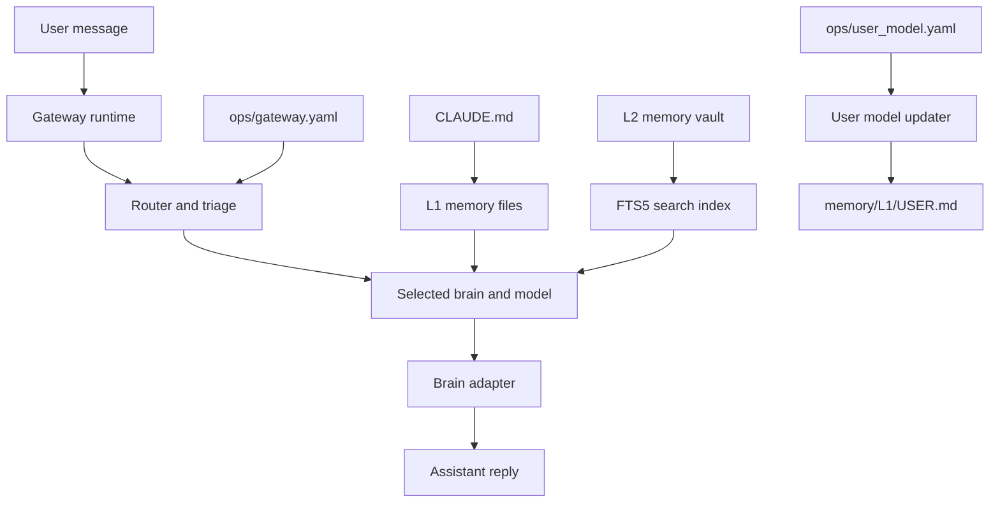
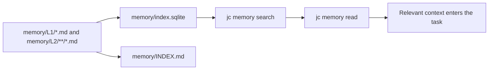
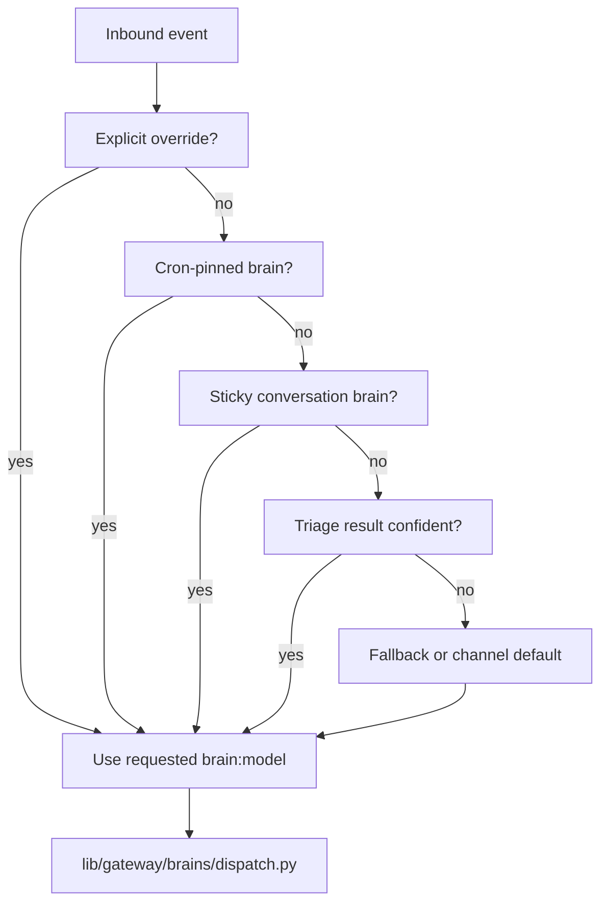
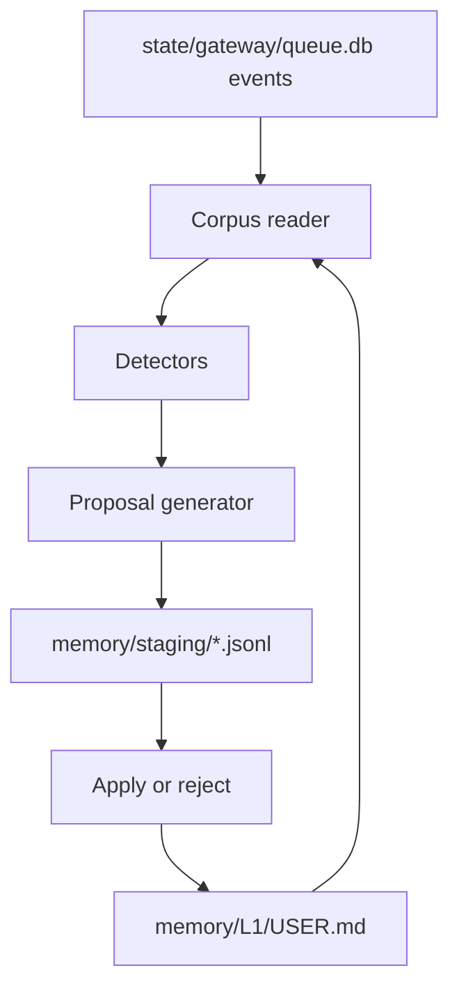
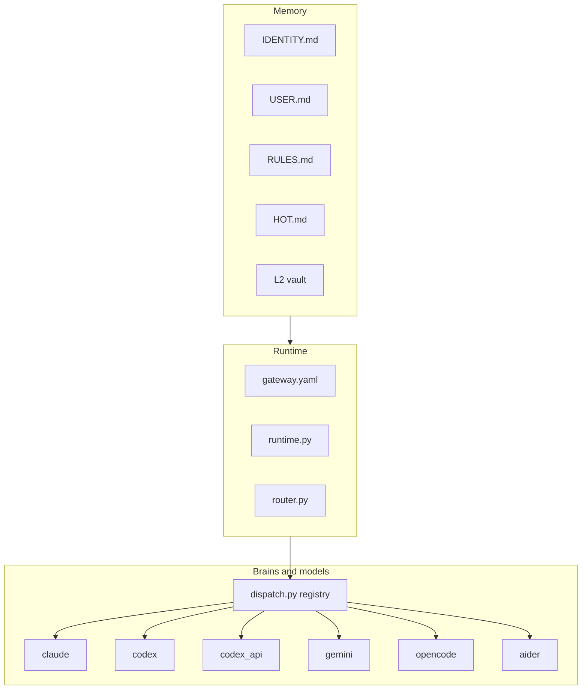

# Agent Brain Structure

Simple high-level report for the JuliusCaesar agent brain.

## Executive summary

The agent brain is not one file. It is a small set of Markdown memory files,
runtime configuration files, and Python dispatch code.

In a real assistant instance, the most important files live under:

- `CLAUDE.md`
- `memory/L1/IDENTITY.md`
- `memory/L1/USER.md`
- `memory/L1/RULES.md`
- `memory/L1/HOT.md`
- `memory/L1/CHATS.md`
- `memory/L2/**/*.md`
- `memory/INDEX.md`
- `memory/index.sqlite`
- `ops/gateway.yaml`
- `ops/user_model.yaml`

In this framework repository, the starter versions live under
`templates/init-instance/`. The framework code that reads, indexes, routes, and
updates them lives mostly under `lib/memory/`, `lib/gateway/`, and
`lib/user_model/`.

## Brain map

## L1 memory: always-loaded brain files

L1 is the small, durable part of the brain. It should stay compact because it
is loaded frequently.

| File | Purpose |
|---|---|
| `CLAUDE.md` | Entry file for Claude Code sessions. It imports the L1 memory files and explains how to use L2 memory. |
| `memory/L1/IDENTITY.md` | Defines who the assistant is, its boundaries, and its basic operating identity. |
| `memory/L1/USER.md` | Stores durable information about the user: profile, preferences, communication style, standing requirements. |
| `memory/L1/RULES.md` | Stores stable rules, corrections, lessons, and operational policies. |
| `memory/L1/HOT.md` | Short rolling cache for what is active now. It is intentionally capped to avoid bloating every session. |
| `memory/L1/CHATS.md` | Known chat/thread context. Claude imports it from `CLAUDE.md`; non-Claude gateway preambles currently load the core four L1 files. |

Template source in this repo:

- `templates/init-instance/CLAUDE.md`
- `templates/init-instance/memory/L1/IDENTITY.md`
- `templates/init-instance/memory/L1/USER.md`
- `templates/init-instance/memory/L1/RULES.md`
- `templates/init-instance/memory/L1/HOT.md`

Runtime loader:

- `lib/gateway/context.py`

Important truth: `lib/gateway/context.py` builds a preamble for non-Claude
brains by concatenating `IDENTITY.md`, `USER.md`, `RULES.md`, and `HOT.md`.
Claude Code gets the imports directly from `CLAUDE.md`.

## L2 memory: searchable long-term memory

L2 is the larger memory vault. It is not always loaded. It is searched when
needed.

Key files and code:

| File | Purpose |
|---|---|
| `memory/L2/**/*.md` | Large durable memory: people, projects, learnings, references, business facts. |
| `memory/INDEX.md` | Generated routing/index file for memory entries. |
| `memory/index.sqlite` | Generated SQLite + FTS5 search index. Safe to rebuild from Markdown. |
| `memory/LOG.md` | Human-readable memory change log. |
| `bin/jc-memory` | CLI surface for memory search, read, write, rebuild, lint, link. |
| `lib/memory/db.py` | Parser and SQLite/FTS5 index implementation. |

Important truth: Markdown is the source of truth. The SQLite database and
`INDEX.md` are derived artifacts.

## Model and brain routing

The gateway decides which brain and model should answer a message.

Key files:

| File | Purpose |
|---|---|
| `ops/gateway.yaml` | Instance config for default brain, default model, triage, per-channel routing, and brain overrides. |
| `lib/gateway/config.py` | Loads and validates gateway config. Defines supported brains and default routing config. |
| `lib/gateway/router.py` | Pure routing decision tree. Order: explicit override, cron pin, sticky, triage, fallback/default. |
| `lib/gateway/runtime.py` | Claims events, applies overrides, invokes the chosen brain, delivers the response. |
| `lib/gateway/triage/` | Optional classifiers that choose route class and brain/model. |
| `lib/gateway/triage/prompt.md` | Triage prompt and default class-to-brain examples. |
| `lib/gateway/brains/dispatch.py` | Registry mapping brain names to Python wrappers. |
| `lib/gateway/brains/*.py` | Per-brain wrappers for Claude, Codex, Codex API, Gemini, Opencode, Aider. |
| `lib/heartbeat/adapters/*.sh` | Shell adapters for native CLI brains. |

Supported brain names in code:

- `claude`
- `codex`
- `codex_api`
- `gemini`
- `opencode`
- `aider`

The direct OpenAI Responses API path is `codex_api`. Its default model is
currently `gpt-5.4-mini` in `lib/gateway/adapters/codex_api.py`, unless the
gateway route passes a different model.

## Autonomous user model

The user model system is the part that can notice patterns over time and
propose updates to `memory/L1/USER.md`.

Key files:

| File | Purpose |
|---|---|
| `ops/user_model.yaml` | Instance config for autonomous user-model updates. Default is disabled. |
| `templates/init-instance/ops/user_model.yaml` | Starter config. |
| `bin/jc-user-model` | CLI wrapper for running/installing/applying user-model updates. |
| `lib/user_model/conf.py` | Loads config. |
| `lib/user_model/corpus.py` | Reads recent conversation/event history. |
| `lib/user_model/detector.py` | Detects repeated topics, communication preferences, priority shifts, new entities, and rule drift. |
| `lib/user_model/proposer.py` | Uses an LLM to generate structured proposals. |
| `lib/user_model/store.py` | Stores proposals as JSONL under `memory/staging/`. |
| `lib/user_model/applier.py` | Applies approved proposals safely, only inside `memory/`, with backups. |
| `lib/user_model/runner.py` | Orchestrates the full detect/propose cycle. |

Important truth: this system updates the brain indirectly. It does not blindly
rewrite `USER.md`; it creates proposals, and apply mode decides whether they
wait for approval or can be applied automatically.

## Runtime state that supports the brain

These are not the identity of the agent, but they help continuity.

| Path | Purpose |
|---|---|
| `state/gateway/queue.db` | Event queue and message history used by the gateway. |
| `state/transcripts/*.jsonl` | Per-conversation transcripts. |
| `state/sessions/` or sessions DB/table | Brain session ids for resuming conversations. |
| `state/gateway/gateway.log` | Runtime log for routing, dispatch, retries, and adapter failures. |
| `state/workers.db` and `state/workers/` | Background worker state. |

These are runtime data. The durable authored brain is still the Markdown
memory and config files.

## Simple mental model

In one sentence:

The agent's brain is the L1/L2 Markdown memory plus gateway model routing, with
`USER.md` kept fresh manually or through the optional autonomous user-model
proposal system.

## What to edit for common changes

| Need | Edit |
|---|---|
| Change who the assistant is | `memory/L1/IDENTITY.md` |
| Change user preferences | `memory/L1/USER.md` |
| Add a stable rule or correction | `memory/L1/RULES.md` |
| Add temporary active context | `memory/L1/HOT.md` |
| Add larger reference memory | `memory/L2/**/*.md`, then run `jc memory rebuild` |
| Change default brain/model | `ops/gateway.yaml` |
| Change route by message class | `ops/gateway.yaml` triage routing |
| Enable automatic user-profile proposals | `ops/user_model.yaml` |

## Source files checked

- `docs/ARCHITECTURE.md`
- `docs/GATEWAY.md`
- `docs/kb/subsystem/memory-system.md`
- `docs/kb/contract/brain-capabilities.md`
- `docs/kb/contract/instance-layout-and-resolution.md`
- `docs/specs/autonomous-user-model.md`
- `templates/init-instance/CLAUDE.md`
- `templates/init-instance/memory/L1/*.md`
- `templates/init-instance/ops/user_model.yaml`
- `lib/gateway/context.py`
- `lib/gateway/config.py`
- `lib/gateway/router.py`
- `lib/gateway/runtime.py`
- `lib/gateway/brains/dispatch.py`
- `lib/gateway/adapters/codex_api.py`
- `lib/memory/db.py`
- `lib/user_model/*.py`
